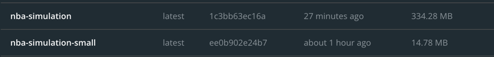

# NBA-Simulation WebSocket Project

To build and run : 

    1- go mod tidy

    2- go build

    3- go run main.go 

    4- Open your browser

    5- http://localhost:8080/

Docker commands :

    docker build -t nba-simulation .
    docker run -p 8080:8080 nba-simulation

For multistage image (smaller):
    
    docker build -f Dockerfile.multistage -t nba-simulation-small .
    docker run -p 8080:8080 nba-simulation-small

Docker Compose commands :
    
    docker compose build
    docker compose up